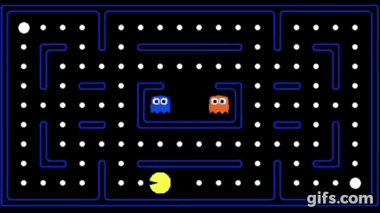

# PacmanDQN
Deep Reinforcement Learning in Pac-man

## Prerequisites
* linux OS
* [docker](https://runnable.com/docker/install-docker-on-linux)
* [docker-compose](https://docs.docker.com/compose/install/). To install it on Linux :
    * sudo curl -L "https://github.com/docker/compose/releases/download/1.25.0/docker-compose-$(uname -s)-$(uname -m)" -o /usr/local/bin/docker-compose
    * sudo chmod +x /usr/local/bin/docker-compose
    * sudo ln -s /usr/local/bin/docker-compose /usr/bin/docker-compose


## Pacman rules
### Context
The player navigates Pac-Man through a maze with no dead ends. The maze is filled with Pac-Dots, and includes four roving multi-colored ghosts: Blinky, Pinky, Inky, and Clyde. There is a passageway from the left side of the screen to the right side, one energizer in each of the four quadrants appear in each level.
### Objective
The objective of the game is to accumulate as many points as possible by eating dots, and blue ghosts. When all of the dots in a stage are eaten, that stage is completed, and the player will advance to the next. The four ghosts roam the maze and chase Pac-Man. If any of the ghosts touches Pac-Man, a life is lost. When all lives have been lost, the game is over. The player begins with three lives. The player will receive one extra life bonus after obtaining 10,000 points.
### Points
Near the corners of the maze are four flashing energizers that allow Pac-Man to eat the ghosts and earn bonus points. The enemies turn deep blue, reverse direction and move away from Pac-Man, and usually move more slowly. When an enemy is eaten, its eyes return to the center ghost box where the ghost is regenerated in its normal color.
 The bonus score earned for eating a blue ghost increases exponentially for each consecutive ghost eaten while a single energizer is active: 
* 200 points for eating one ghost, 
* 400 for a second, 
* 800 for a third, 
* 1600 for the fourth. 

This cycle restarts from 200 points when Pac-Man eats the next energizer. 
Blue enemies flash white to signal that they are about to return to their normal color and become dangerous again; 
the length of time the enemies remain vulnerable varies from one stage to the next, generally becoming shorter as the game progresses. 
In later stages, the enemies begin flashing immediately after an energizer is consumed, without a solid-blue phase; 
starting at stage nineteen, the ghosts do not become edible at all, but still reverse direction. 

## Demo



## Example usage

Run the command `sudo docker-compose up`
Notice: you have to run at least one time the command `xhost local:root` to have the validation games display

Run a model on `smallGrid` layout for 6000 episodes, of which 5000 episodes
are used for training. The 1000 episodes remaining is displayed in a window to watch the game
Edit the variables in `.env` file:

### Layout
Different layouts can be found and created in the `layouts` directory
For more information, take a look on the [readme file](layouts/README.md) in layout directory.
Set the value variable `LAYOUT` to the name of the layout you want. 

### TOTAL_GAMES_NB
Represents the total amount of games that will be played.
The games number for training is equal to TOTAL_GAMES_NB-VALIDATION_GAMES_NB

### VALIDATION_GAMES_NB
Represents the games number played for validation.
These games will be displayed on your screen

### OTHER Parameters

Parameters can be found in the `params` dictionary in `pacmanDQN_Agents.py`. <br />
 <br />
Models are saved as "checkpoint" files in the `/saves` directory. <br />
Load and save filenames can be set using the `load_file` and `save_file` parameters. <br />
 <br />
Episodes before training starts: `train_start` <br />
Size of replay memory batch size: `batch_size` <br />
Amount of experience tuples in replay memory: `mem_size` <br />
Discount rate (gamma value): `discount` <br />
Learning rate: `lr` <br />
 <br />
Exploration/Exploitation (ε-greedy): <br />
Epsilon start value: `eps` <br />
Epsilon final value: `eps_final` <br />
Number of steps between start and final epsilon value (linear): `eps_step` <br />

## Citation

```
@article{van2016deep,
  title={Deep Reinforcement Learning in Pac-man},
  subtitle={Bachelor Thesis},
  author={van der Ouderaa, Tycho},
  year={2016},
  school={University of Amsterdam},
  type={Bachelor Thesis},
  pdf={https://esc.fnwi.uva.nl/thesis/centraal/files/f323981448.pdf},
}

```

* [van der Ouderaa, Tycho (2016). Deep Reinforcement Learning in Pac-man.](https://esc.fnwi.uva.nl/thesis/centraal/files/f323981448.pdf)

## Requirements

- `python>=3.5.1`
- `tensorflow>=0.8rc`
- `numpy`

## Acknoledgements

Article exaplaining deep reinforcement learning for Pacman made by Towards data science
* [Advanced DQNs: Playing Pac-man with Deep Reinforcement Learning https://towardsdatascience.com/advanced-dqns-playing-pac-man-with-deep-reinforcement-learning-3ffbd99e0814](https://towardsdatascience.com/advanced-dqns-playing-pac-man-with-deep-reinforcement-learning-3ffbd99e0814)

Wikipedia page on pacman
* [Pac-Man Wikipedia (https://en.wikipedia.org/wiki/Pac-Man)](https://en.wikipedia.org/wiki/Pac-Man)

DQN Framework by  (made for ATARI / Arcade Learning Environment)
* [deepQN_tensorflow](https://github.com/mrkulk/deepQN_tensorflow) ([https://github.com/mrkulk/deepQN_tensorflow](https://github.com/mrkulk/deepQN_tensorflow))

Pac-man implementation by UC Berkeley:
* [The Pac-man Projects - UC Berkeley](http://ai.berkeley.edu/project_overview.html) ([http://ai.berkeley.edu/project_overview.html](http://ai.berkeley.edu/project_overview.html))

Pac-man implementation by tychovodo
* [PacmanDQN](https://github.com/tychovdo/PacmanDQN)